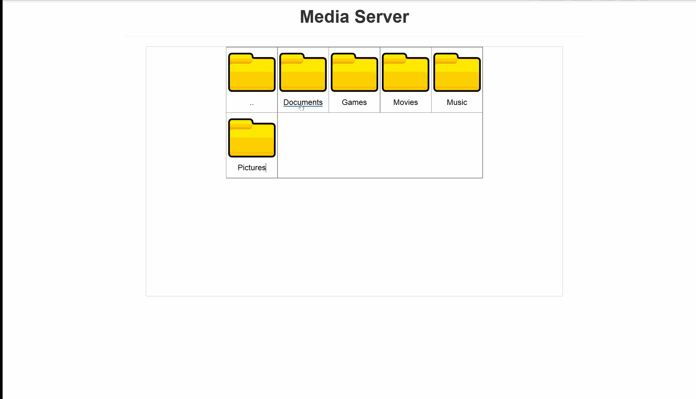

#Media Server
<div align="center">

</div>
<br />
<hr />
##Run the install script
To install the server, use the terminal and run
```shell
./install.sh
```
####Created by Macon Williams and Spencer Hanson
This is a media server with a client designed to store personal files such as music, movies, and other forms of media. 

##Tools in progress:
PlaylistGenerator - Used to search the music library for arbitrary playlist names and output to different creators
M3UCreator - creates a m3u based on given input from the playlist generator

##Tools in waiting:
iphonePlaylistCreator - Creates a playlist for an iphone
mediaServerPlaylistCreator - Creates a playlist to be played online from the server
androidPlaylistCreator - Creates a playlist for an android phone
musicSorter - Sorts the music into folders and by album
